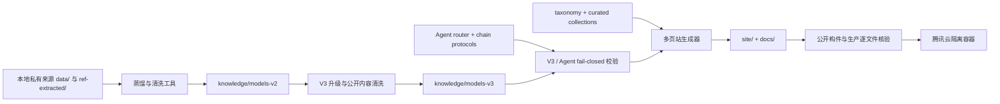

# 前车之鉴-思维制胜

在对的方向上前行，效率不值一提。

「前车之鉴-思维制胜」是一套中文思维模型知识系统，也是一座可本地运行的静态知识网站。当前版本收录 2789 个 V3 模型、13 个认知章节、19 类 Agent 角色，并提供问题路由、模型检索、推理步骤与 Codex 共学提示词。

生产地址：[xmind.lute-tlz-dddd.top](https://xmind.lute-tlz-dddd.top/)

## 产品能力

- **问题路由**：输入问题描述，在浏览器本地匹配诊断、计划、决策、研究、表达等推理路径；输入不会上传或保存。
- **多页模型库**：按名称、定义、触发信号、标签和 Agent 角色筛选 2789 个模型。
- **十三章知识地图**：十三位历史女性以现代策展角色引导十三章；每个模型只属于一个主章节，
  并通过标签和角色建立跨章节连接。
- **推理协议**：模型详情包含适用信号、停止条件、推理步骤、检查点、场景和常见误区。
- **Codex 应用卡**：带有 activation 和 system prompt 的模型可以一键复制完整提示词。
- **Agent 能力图谱**：19 类角色被组织为意图澄清、结构推演、多路探索、决策取舍、计划执行、复盘校正、知识综合和清晰表达八段流程。
- **隐私优先**：网站无追踪、无远程字体、无前端网络请求；公开产物不得包含原始 Markdown、微信来源 URL 或服务器私钥。

完整使用方法见 [用户说明书](manuals/USER_GUIDE.md)，架构和能力边界见 [能力图谱](manuals/CAPABILITY_MAP.md)。

## 品牌与视觉

产品名固定为"前车之鉴-思维制胜"，副标题固定为"在对的方向上前行，效率不值一提"。
当前视觉系统为"东方纸雕纪念像 V2"，品牌叙事为"十三卷 · 十三位历史女性导师"：
以历史女性的精神身份连接章节方法，用东方彩绘人物、立体剪纸和纪念碑式留白形成统一气象。

视觉系统由三层数据驱动：`knowledge/chapter-mentors.json`（导师文字档案）+
`knowledge/chapter-themes.json`（章节配色、纹样与图片路径）+
`tools/site-assets/images/mentors/chapters/`（13 组 AVIF/WebP 生产资产）。
页面展示（卡片比例、Hero 布局、章节色）由构建器从数据合同确定性生成，图片不承载任何文字信息。

导师是章节策展角色，不是 2789 个现代模型的作者；人物图均为依据时代资料创作的艺术化演绎，
不声称复原真实容貌，也不使用未经核验的历史引语。完整规则见
[东方纸雕纪念像与十三章设计规格](specs/2026-08-08-oriental-paper-sculpture-brand-and-chapter-design.md)。

> **当前状态**：V4 东方彩绘导师版本已部署到腾讯云；最新生产构件为
> `8acae8761f368c441b5f596c201bad139cbd8427faba9402dbc3b8e2655c43d0`（2864 文件）。
> 全量测试 `1072/1072`，生产逐文件一致性、浏览器 E2E、单一安全响应头和 32 个邻接域名回归均通过。
> 核心发布提交 `d929e32f4bba1fe35ab4173870c60aae338a984a` 已推送到 `origin/main`，
> [GitHub Pages 镜像](https://zjgulai.github.io/deep-thinking-mode/) 与腾讯云主站均已通过 2864/2864 文件逐字节验证。

## 快速开始

要求 Node.js 20 或更高版本；CI 使用 Node.js 24.18.0。

```bash
npm ci
npm run release:check
python3 -m http.server 8765 --directory site
```

浏览器打开 `http://127.0.0.1:8765/`。`release:check` 会依次执行语法与数据校验、全量测试、确定性构建和公开产物闭包检查。

常用命令：

```bash
npm run validate:data      # V3、taxonomy、router 和公开残留检查
npm test                   # 全量 Node 测试
npm run build              # 生成 site/，并完整镜像到 docs/
npm run check:public       # 校验多页链接、资源、锚点、CSP 边界和 UTF-8
node tools/verify-production.mjs --url https://xmind.lute-tlz-dddd.top/
npm run verify:security
```

## 能力与数据流



关键契约：

1. `model.meta.agent_roles` 是唯一 Agent 角色字段。
2. 所有公开 V3 文件必须是 schema `3.0.0`，ID 唯一且能被 taxonomy 归类。
3. Router 引用的模型必须存在，并声明该路由要求的角色。
4. `site/` 是唯一生产构件；`docs/` 必须与它逐字节同步。
5. 构建先写入候选目录，通过校验后再整体替换，文件名和页面排序必须确定。

## 项目结构

```text
knowledge/
  models-v2/               公开中间格式
  models-v3/               生产模型与 Codex 协议
  taxonomy.json            十三章唯一主分类
  curated-collections.json 场景策展入口
  chapter-mentors.json     13 位导师文字档案（朝代、角色、策展导语、史实边界）
  chapter-themes.json      13 章配色 token、纹样矩阵与图片路径/hash
chain-protocols/            Agent router、角色与链式协议
tools/
  build-site.mjs            确定性多页构建（含章节主题注入）
  lib/chapter-presentation.mjs  章节展示数据合同与验证
  validate-v3-agent-data.mjs
  sanitize-public-models.mjs
  check-public-artifact.mjs
  verify-production.mjs
  verify-security-headers.mjs
  site-assets/
    site.css                全局样式（东方纸雕纪念像主题）
    chapters/               13 章导师 AVIF/WebP 生产图片
site/                       腾讯云和 Pages 使用的完整发布树
docs/                       site/ 的完整镜像
tests/                      单元、契约、安全与发布回归测试（含 chapter-presentation）
manuals/                    用户、架构和发布资料
deploy/tencent-cloud/       隔离 Docker 部署资产与 Runbook
specs/                      产品和工程设计规格
```

## 发布与安全

腾讯云发布使用独立 Compose project、独立网络、非 root 只读容器、固定基础镜像 digest 和默认拒绝的 Docker build context。公网 80/443 由服务器已有的共享 Nginx 入口转发。首次接入域名时必须执行入口配置备份、`nginx -t`、有界切换、既有域名回归和可逆回滚；入口与证书已经健康的普通内容更新只替换 `xmind_site` 不可变镜像，禁止顺手 reload 共享入口或修改证书。

发布单元是完整多页 `site/`，不是单个 `index.html`。首页、共享资产、13 个章节页、2789 个
模型详情页、Router、404、robots 和 sitemap 必须作为同一构建候选、同一构件 hash 与同一
镜像版本部署；`docs/` 只作为逐字节兼容镜像。部署完成还必须经过腾讯云 origin、共享入口、
生产逐文件一致性和浏览器 E2E 四个独立门，不能用本地构建成功推断已经上线。
生产响应还必须通过独立安全头门：CSP 由站点 origin 提供，`frame-ancestors` 仅放在 HTTP
响应头；公网入口提供 HSTS、`nosniff`、反嵌入、Referrer Policy 和 Permissions Policy，
每项必须恰好出现一次。

详细步骤见 [腾讯云部署 Runbook](deploy/tencent-cloud/xmind-site/RUNBOOK.md) 和 [发布验收清单](manuals/RELEASE_CHECKLIST.md)。禁止把项目根目录作为 Docker build context，禁止传输 `data/`、`.git/`、`DDDD.pem`、`ref/`、`node_modules/` 或 `graphify-out/`。

## 已知边界

- 问题路由器是确定性的本地关键词导航，不是大模型判断；结果用于缩小候选，不替代人的最终选择。
- 现有语料仍存在重名、近重复和内容颗粒度不均，质量分只是内容治理信号，不是事实正确性的保证。
- 模型用于组织思考，不替代医疗、法律、财务等专业意见；关键结论必须回到证据、数据和真实反馈中复核。
- Graphify 是架构审计辅助，不是运行时依赖；旧图不得作为当前发布结论，发布前必须重新提取 code-only 图。
- Git public-tree 门禁只有在候选内容形成提交后才具备完整的 commit 级证明；工作区构建成功不等于已 commit、已 push 或已上线。

## 文档

- [用户说明书](manuals/USER_GUIDE.md)
- [能力图谱与架构](manuals/CAPABILITY_MAP.md)
- [发布验收清单](manuals/RELEASE_CHECKLIST.md)
- [腾讯云隔离部署 Runbook](deploy/tencent-cloud/xmind-site/RUNBOOK.md)
- [知识系统设计](specs/2026-07-27-brain-model-knowledge-system-design.md)
- [网站设计](specs/2026-07-30-systematic-thinking-site-design.md)
- [东方纸雕纪念像与十三章设计规格](specs/2026-08-08-oriental-paper-sculpture-brand-and-chapter-design.md)
- [东方纸雕视觉版本实施与部署 TODO](specs/2026-08-08-oriental-paper-sculpture-site-execution-todo.md)

## 贡献

提交改动前至少运行 `npm run release:check`。任何模型内容、构建器或发布边界变更，都必须同时更新相应测试和文档。当前仓库尚未声明开源许可证；获得明确授权前，不应默认拥有复制、修改或再分发权。
