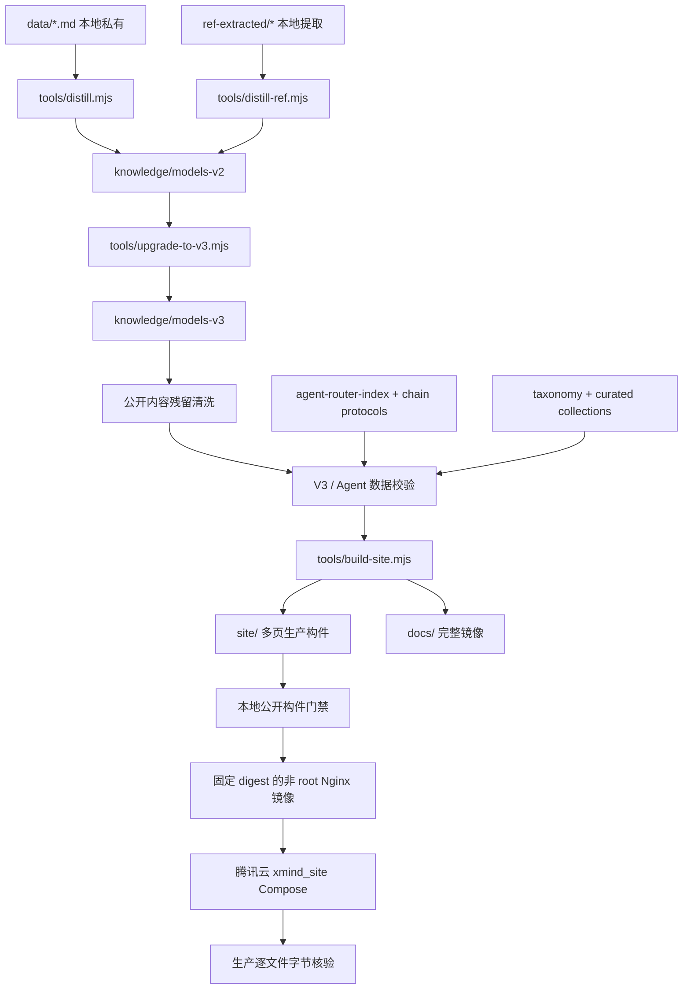

# 能力图谱与架构

## 1. 产品能力图谱

| 能力层 | 输入 | 核心能力 | 输出 | 主要门禁 |
| --- | --- | --- | --- | --- |
| 私有来源层 | 本地 Markdown、提取资料 | 来源保护、解析、清洗 | 本地中间材料 | 公开路径 allowlist、历史扫描 |
| 知识加工层 | 清洗内容 | 蒸馏、V2 归一、V3 升级 | 2789 个 V3 模型 | schema、唯一 ID、taxonomy、残留检查 |
| 能力编排层 | V3 模型、Router、Chain | 角色映射、问题类型、模型推荐 | 19 类 Agent 角色、8 段流程 | 路由引用存在、角色契约一致 |
| 产品呈现层 | 模型、taxonomy、策展集合 | 多页生成、搜索、详情、路由 | `site/` 与 `docs/` | 确定性、完整链接、CSP、UTF-8 |
| 发布层 | 已验证 `site/` | 镜像打包、隔离运行、TLS、回滚 | 腾讯云生产站 | 镜像 hash、origin 健康、逐文件生产核验 |

## 2. 真实数据流

`arena`、部分实验性 chain 以及 Graphify 图不参与网站运行时构建。它们是评估、编排设计或架构审计输入，不能把“文件存在”误报成“产品已接通”。

## 3. 关键契约

### V3 与 Agent

- schema version 固定为 `3.0.0`。
- `id` 在全库唯一。
- `meta.category` 必须对应 taxonomy 中的单一主章节。
- 唯一角色字段为 `meta.agent_roles: string[]`。
- Router 中每个非空模型文件引用必须存在；目标模型必须声明该路由的所有推荐角色。
- 构建器不得为缺失字段静默降级为“空卡片”。

### 网站

- 生成器只读取公开 V3、taxonomy、curated collections 和 router。
- 路径、排序和文件名确定；不得使用 `Math.random()`。
- `site/` 先在候选目录生成，再整体替换；失败时恢复上一版。
- `docs/` 与 `site/` 完整同步，不只复制首页。
- 前端不发起网络请求，不用 `innerHTML` 处理用户输入。

### 发布

- Docker context 默认拒绝，只允许完整 `site/` 发布树和两份 Nginx/Docker 定义。
- 容器非 root、只读文件系统、drop all capabilities、独立内部网络、限制 CPU/内存/PID/日志。
- `172.20.0.1:18888` 只作为共享入口可达的 origin，不向公网直接开放。
- 公网入口变更必须先备份、`nginx -t`，再 graceful reload；失败立即恢复。
- 生产验收逐文件比较状态码、Content-Type、重定向和字节 hash，不允许只测首页。

## 4. 当前能力成熟度

| 能力 | 状态 | 证据或边界 |
| --- | --- | --- |
| V3 基础契约 | 已接通 | 2789 个模型、ID 唯一、schema 全为 3.0.0 |
| Agent 角色映射 | 已接通 | 60 个角色分配，覆盖 19 类角色，8 段流程均非 0 |
| 多页知识站 | 已接通 | 首页、模型库、2789 详情、13 章节、Router、404、SEO 资源 |
| 本地路由 | 已接通 | 关键词匹配，明确标注非 AI 判断、不上传输入 |
| 公开构件门禁 | 已接通 | 递归链接、资源、锚点、路径边界、危险 scheme、UTF-8、软链 |
| 生产验证 | 已接通 | 对完整远端树逐文件核验，不只检查首页 |
| 语料去重与人工激活度 | 未完全收口 | 重名、近重复、颗粒度不均仍需持续治理 |
| Graphify 当前图 | 发布前重建 | 旧图落后当前实现，不能作为当前架构证明 |
| Git commit 级公开树证明 | 需提交后执行 | 工作区构建不等于 commit、push 或生产发布 |

## 5. 对抗性风险清单

- **高风险：公开源残留回归。** 任何蒸馏或升级变更都必须继续运行 `sanitize-public-models.mjs` 的 check 模式。
- **高风险：发布只带首页。** Docker、Pages 和生产验证都必须覆盖完整多页目录。
- **高风险：共享入口耦合。** 同一公网 IP 的 80/443 仍由已有 Nginx 承担；需对既有域名做发布前后回归。
- **中风险：内容同质化。** 重名和相同 prompt 会降低检索质量，应通过稳定 ID、语义聚类和人工策展逐批治理。
- **中风险：Router 召回有限。** 当前关键词方法透明且私密，但对隐含意图、否定语义和多目标问题处理有限。
- **中风险：依赖安全。** 生产站是纯静态构件，运行镜像不携带 Node 依赖；构建依赖仍应在每次发布前审计并按风险决定升级。
